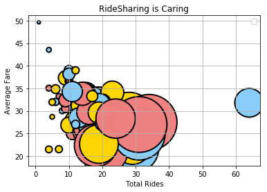
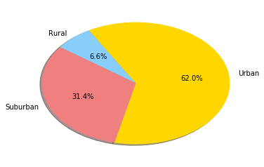
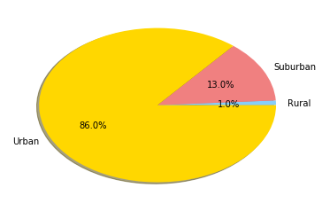
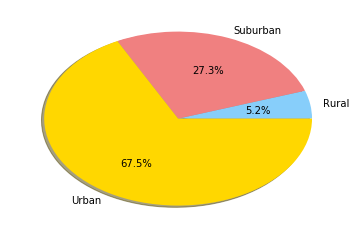

```python
# Dependencies
import matplotlib.pyplot as plt
import scipy.stats as stats
import numpy as np
import os
import pandas as pd
import matplotlib.cm as cm
```


```python
csvpath = os.path.join('raw_data', 'city_data.csv')
city_data = pd.read_csv(csvpath)
city_data.head()
```


<div>
<style>
    .dataframe thead tr:only-child th {
        text-align: right;
    }

    .dataframe thead th {
        text-align: left;
    }

    .dataframe tbody tr th {
        vertical-align: top;
    }
</style>
<table border="1" class="dataframe">
  <thead>
    <tr style="text-align: right;">
      <th></th>
      <th>city</th>
      <th>driver_count</th>
      <th>type</th>
    </tr>
  </thead>
  <tbody>
    <tr>
      <th>0</th>
      <td>Kelseyland</td>
      <td>63</td>
      <td>Urban</td>
    </tr>
    <tr>
      <th>1</th>
      <td>Nguyenbury</td>
      <td>8</td>
      <td>Urban</td>
    </tr>
    <tr>
      <th>2</th>
      <td>East Douglas</td>
      <td>12</td>
      <td>Urban</td>
    </tr>
    <tr>
      <th>3</th>
      <td>West Dawnfurt</td>
      <td>34</td>
      <td>Urban</td>
    </tr>
    <tr>
      <th>4</th>
      <td>Rodriguezburgh</td>
      <td>52</td>
      <td>Urban</td>
    </tr>
  </tbody>
</table>
</div>


```python
csvpath = os.path.join('raw_data', 'ride_data.csv')
ride_data = pd.read_csv(csvpath)
ride_data.head()
```


<div>
<style>
    .dataframe thead tr:only-child th {
        text-align: right;
    }

    .dataframe thead th {
        text-align: left;
    }

    .dataframe tbody tr th {
        vertical-align: top;
    }
</style>
<table border="1" class="dataframe">
  <thead>
    <tr style="text-align: right;">
      <th></th>
      <th>city</th>
      <th>date</th>
      <th>fare</th>
      <th>ride_id</th>
    </tr>
  </thead>
  <tbody>
    <tr>
      <th>0</th>
      <td>Sarabury</td>
      <td>2016-01-16 13:49:27</td>
      <td>38.35</td>
      <td>5403689035038</td>
    </tr>
    <tr>
      <th>1</th>
      <td>South Roy</td>
      <td>2016-01-02 18:42:34</td>
      <td>17.49</td>
      <td>4036272335942</td>
    </tr>
    <tr>
      <th>2</th>
      <td>Wiseborough</td>
      <td>2016-01-21 17:35:29</td>
      <td>44.18</td>
      <td>3645042422587</td>
    </tr>
    <tr>
      <th>3</th>
      <td>Spencertown</td>
      <td>2016-07-31 14:53:22</td>
      <td>6.87</td>
      <td>2242596575892</td>
    </tr>
    <tr>
      <th>4</th>
      <td>Nguyenbury</td>
      <td>2016-07-09 04:42:44</td>
      <td>6.28</td>
      <td>1543057793673</td>
    </tr>
  </tbody>
</table>
</div>


```python
total_data = pd.merge(ride_data, city_data,
                        how='outer', on='city')
total_data.head()
```


<div>
<style>
    .dataframe thead tr:only-child th {
        text-align: right;
    }

    .dataframe thead th {
        text-align: left;
    }

    .dataframe tbody tr th {
        vertical-align: top;
    }
</style>
<table border="1" class="dataframe">
  <thead>
    <tr style="text-align: right;">
      <th></th>
      <th>city</th>
      <th>date</th>
      <th>fare</th>
      <th>ride_id</th>
      <th>driver_count</th>
      <th>type</th>
    </tr>
  </thead>
  <tbody>
    <tr>
      <th>0</th>
      <td>Sarabury</td>
      <td>2016-01-16 13:49:27</td>
      <td>38.35</td>
      <td>5403689035038</td>
      <td>46</td>
      <td>Urban</td>
    </tr>
    <tr>
      <th>1</th>
      <td>Sarabury</td>
      <td>2016-07-23 07:42:44</td>
      <td>21.76</td>
      <td>7546681945283</td>
      <td>46</td>
      <td>Urban</td>
    </tr>
    <tr>
      <th>2</th>
      <td>Sarabury</td>
      <td>2016-04-02 04:32:25</td>
      <td>38.03</td>
      <td>4932495851866</td>
      <td>46</td>
      <td>Urban</td>
    </tr>
    <tr>
      <th>3</th>
      <td>Sarabury</td>
      <td>2016-06-23 05:03:41</td>
      <td>26.82</td>
      <td>6711035373406</td>
      <td>46</td>
      <td>Urban</td>
    </tr>
    <tr>
      <th>4</th>
      <td>Sarabury</td>
      <td>2016-09-30 12:48:34</td>
      <td>30.30</td>
      <td>6388737278232</td>
      <td>46</td>
      <td>Urban</td>
    </tr>
  </tbody>
</table>
</div>


```python
# Bubble Chart
# # Average Fare ($) Per City
city_grouped = total_data.groupby('city')
city_average_fare = city_grouped["fare"].mean()
city_average_fare_df = pd.DataFrame(city_average_fare)

city_average_fare_df.head()
```


<div>
<style>
    .dataframe thead tr:only-child th {
        text-align: right;
    }

    .dataframe thead th {
        text-align: left;
    }

    .dataframe tbody tr th {
        vertical-align: top;
    }
</style>
<table border="1" class="dataframe">
  <thead>
    <tr style="text-align: right;">
      <th></th>
      <th>fare</th>
    </tr>
    <tr>
      <th>city</th>
      <th></th>
    </tr>
  </thead>
  <tbody>
    <tr>
      <th>Alvarezhaven</th>
      <td>23.928710</td>
    </tr>
    <tr>
      <th>Alyssaberg</th>
      <td>20.609615</td>
    </tr>
    <tr>
      <th>Anitamouth</th>
      <td>37.315556</td>
    </tr>
    <tr>
      <th>Antoniomouth</th>
      <td>23.625000</td>
    </tr>
    <tr>
      <th>Aprilchester</th>
      <td>21.981579</td>
    </tr>
  </tbody>
</table>
</div>


```python
# # Total Number of Rides Per City
city_grouped = total_data.groupby('city')
city_total_rides = city_grouped["date"].count()
city_total_rides_df = pd.DataFrame(city_grouped["date"].count())

city_total_rides_df.head()
```


<div>
<style>
    .dataframe thead tr:only-child th {
        text-align: right;
    }

    .dataframe thead th {
        text-align: left;
    }

    .dataframe tbody tr th {
        vertical-align: top;
    }
</style>
<table border="1" class="dataframe">
  <thead>
    <tr style="text-align: right;">
      <th></th>
      <th>date</th>
    </tr>
    <tr>
      <th>city</th>
      <th></th>
    </tr>
  </thead>
  <tbody>
    <tr>
      <th>Alvarezhaven</th>
      <td>31</td>
    </tr>
    <tr>
      <th>Alyssaberg</th>
      <td>26</td>
    </tr>
    <tr>
      <th>Anitamouth</th>
      <td>9</td>
    </tr>
    <tr>
      <th>Antoniomouth</th>
      <td>22</td>
    </tr>
    <tr>
      <th>Aprilchester</th>
      <td>19</td>
    </tr>
  </tbody>
</table>
</div>


```python
# # Total Number of Drivers Per City
city_grouped = total_data.groupby('city')
city_total_drivers = city_grouped["driver_count"].sum()
city_total_drivers_df = pd.DataFrame(city_grouped["driver_count"].sum())
city_total_drivers_df.reset_index(level=0, inplace=True)
city_total_drivers_df.head()
```


<div>
<style>
    .dataframe thead tr:only-child th {
        text-align: right;
    }

    .dataframe thead th {
        text-align: left;
    }

    .dataframe tbody tr th {
        vertical-align: top;
    }
</style>
<table border="1" class="dataframe">
  <thead>
    <tr style="text-align: right;">
      <th></th>
      <th>city</th>
      <th>driver_count</th>
    </tr>
  </thead>
  <tbody>
    <tr>
      <th>0</th>
      <td>Alvarezhaven</td>
      <td>651</td>
    </tr>
    <tr>
      <th>1</th>
      <td>Alyssaberg</td>
      <td>1742</td>
    </tr>
    <tr>
      <th>2</th>
      <td>Anitamouth</td>
      <td>144</td>
    </tr>
    <tr>
      <th>3</th>
      <td>Antoniomouth</td>
      <td>462</td>
    </tr>
    <tr>
      <th>4</th>
      <td>Aprilchester</td>
      <td>931</td>
    </tr>
  </tbody>
</table>
</div>


```python
# City Type (Urban, Suburban, Rural)
city_grouped = total_data.groupby('city')
city_type = city_grouped["type"].unique()
city_type_df = pd.DataFrame(city_grouped["type"].unique())
city_type_df.reset_index(level=0, inplace=True)
city_type.head()

city_type_grouped = total_data.groupby('type')
city_type_total = city_type_grouped["city"].count()
city_type_total_df = pd.DataFrame(city_type_grouped["city"].count())
city_type_total_df.reset_index(level=0, inplace=True)
city_type_total_df.head()

```


<div>
<style>
    .dataframe thead tr:only-child th {
        text-align: right;
    }

    .dataframe thead th {
        text-align: left;
    }

    .dataframe tbody tr th {
        vertical-align: top;
    }
</style>
<table border="1" class="dataframe">
  <thead>
    <tr style="text-align: right;">
      <th></th>
      <th>type</th>
      <th>city</th>
    </tr>
  </thead>
  <tbody>
    <tr>
      <th>0</th>
      <td>Rural</td>
      <td>125</td>
    </tr>
    <tr>
      <th>1</th>
      <td>Suburban</td>
      <td>657</td>
    </tr>
    <tr>
      <th>2</th>
      <td>Urban</td>
      <td>1625</td>
    </tr>
  </tbody>
</table>
</div>


```python
combined_data = pd.DataFrame({"Average_Fare": city_average_fare,
                             "Total_Rides": city_total_rides,
                              "Driver_Total": city_total_drivers,
                              "City_Type": city_type,
                            })

combined_data.head()
```


<div>
<style>
    .dataframe thead tr:only-child th {
        text-align: right;
    }

    .dataframe thead th {
        text-align: left;
    }

    .dataframe tbody tr th {
        vertical-align: top;
    }
</style>
<table border="1" class="dataframe">
  <thead>
    <tr style="text-align: right;">
      <th></th>
      <th>Average_Fare</th>
      <th>City_Type</th>
      <th>Driver_Total</th>
      <th>Total_Rides</th>
    </tr>
    <tr>
      <th>city</th>
      <th></th>
      <th></th>
      <th></th>
      <th></th>
    </tr>
  </thead>
  <tbody>
    <tr>
      <th>Alvarezhaven</th>
      <td>23.928710</td>
      <td>[Urban]</td>
      <td>651</td>
      <td>31</td>
    </tr>
    <tr>
      <th>Alyssaberg</th>
      <td>20.609615</td>
      <td>[Urban]</td>
      <td>1742</td>
      <td>26</td>
    </tr>
    <tr>
      <th>Anitamouth</th>
      <td>37.315556</td>
      <td>[Suburban]</td>
      <td>144</td>
      <td>9</td>
    </tr>
    <tr>
      <th>Antoniomouth</th>
      <td>23.625000</td>
      <td>[Urban]</td>
      <td>462</td>
      <td>22</td>
    </tr>
    <tr>
      <th>Aprilchester</th>
      <td>21.981579</td>
      <td>[Urban]</td>
      <td>931</td>
      <td>19</td>
    </tr>
  </tbody>
</table>
</div>


```python
# Create a scatter plot
type_grouped = total_data.groupby('type')
colors = ["lightskyblue", "lightcoral", "gold"]
#rural = [label="Rural"]
#suburban = (label="Suburban") 
#urban = (label="Urban")
combined_data.plot(kind="scatter", x="Total_Rides", y="Average_Fare", 
               grid=True, linewidth=2, edgecolor ='black',
               title="RideSharing is Caring", sizes=city_total_drivers*3, alpha=5, color=colors)
plt.legend(handles=(), loc="best")
plt.xlabel('Total Rides')
plt.ylabel('Average Fare')
plt.show()
```





```python
type_grouped = total_data.groupby('type')
type_total_fare = type_grouped["fare"].sum()
type_total_fare_df = pd.DataFrame(type_grouped["fare"].sum())
type_total_fare_df
type_total_fare_df.reset_index(level=0, inplace=True)
type_total_fare_df.head()
plt.pie(type_total_fare_df['fare'], labels=type_total_drivers_df['type'], colors=colors, shadow=True, startangle=120, autopct="%1.1f%%")
plt.show()
```





```python
type_grouped = total_data.groupby('type')
type_total_drivers = type_grouped["driver_count"].sum()
type_total_drivers_df = pd.DataFrame(type_grouped["driver_count"].sum())
type_total_drivers_df
type_total_drivers_df.reset_index(level=0, inplace=True)
type_total_drivers_df.head()
plt.pie(type_total_drivers_df['driver_count'], labels=type_total_drivers_df['type'], colors=colors, shadow=True, startangle=0, autopct="%1.1f%%")
plt.show()
```





```python
type_grouped = total_data.groupby('type')
type_total_rides = type_grouped["date"].count()
type_total_rides_df = pd.DataFrame(type_grouped["date"].count())
type_total_rides_df
type_total_rides_df.reset_index(level=0, inplace=True)
type_total_rides_df.head()
plt.pie(type_total_rides_df['date'], labels=type_total_drivers_df['type'], colors=colors, shadow=True, startangle=0, autopct="%1.1f%%")
plt.show()
```




